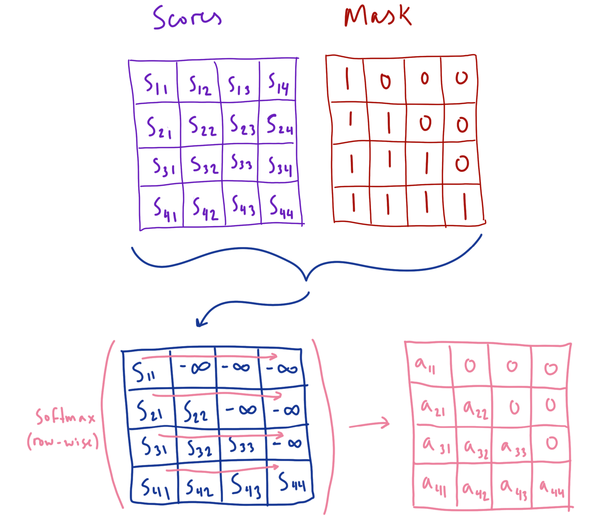

# Transformers in a Nutshell
## Introduction

For the uninitiated, transformers have —in the past few years— become the de facto standard choice of architecture for deep learning models across domains ranging from text and images all the way to 3D point clouds and model-based reinforcement learning. In this post, I will try to encapsulate and convey all the key pieces of information needed to intuit, precisely describe, and implement the transformer architecture. To show you how these ideas take working form, we will use a GPT-like causal language model as a motivating code example; utilizing tools like PyTorch-Lightning and Weights & Biases to step through the entire development process and complete a fully trainable and usable model.

I cannot, of course, fit everything interesting about the intuitions for transformers or their use cases into one blog post (there will be subsequent posts going further down the rabbit-hole), but I hope one comes away from this introduction confident that they can dive into papers and codebases with the necessary foundations to understand what you read. So without further ado, let’s dive in!

---

## Transformers, tl;dr.

For the impatient reader, the transformer is a parameterized, differentiable function which maps a discrete set of vectors to another —equally sized— discrete set of vectors. It does so by interleaving *global* interactions between vectors (ie. self-attention) with individual, *vector-wise* non-linear transformations (ie. Multi-layer Perceptron) to optionally (due to residual connections) modify each vector’s representation at each step along its path through the network. These global interactions between all elements in the set happen in a component called the *multi-headed* *self-attention* layer, where ***self-*** refers to the fact that elements are looking at other elements from the same set. This layer learns to appropriately mix select amounts of corresponding subspaces from each vector in the set independently and in parallel. These distinct collections of corresponding subspaces are what’s known as ***attention heads***. Once the information is mixed, the attention heads are concatenated back into a full-sized vector, projected back into the original embedding space, and transformed via an MLP to produce a new representation for each of the composite vectors. Furthermore, we can add to each vector in the input set information about its position relative to other vectors in the set with what’s called a *positional encoding* (or alternatively, a learned *positional embedding*). This allows the transformer to learn about *sequences* of vectors effectively when order in the input matters. Finally, to facilitate a more seamless optimization process, normalization layers and residual connections are added between these interleaved operations so that gradients can flow nicely during back-propagation.

](https://peterbloem.nl/files/transformers/transformer-block.svg)

[https://peterbloem.nl/blog/transformers](https://peterbloem.nl/blog/transformers)

---

## Attention: The Continuous Hash-Table

As previously mentioned, the self-attention mechanism is a means of appropriately mixing information from a set of elements, but how does it actually work? As a useful analogy to build our intuitions for the mechanics of attention, we can think this mechanism as a continuous hash-table containing vector-valued keys and values. For a given key, a normal hash-table will return to us a value corresponding to that key in the table. One key will correspond with one value. Now, imagine for a moment that we wrapped this hash-table in a new object which defined some modified behavior for our key-value table. Instead of providing a key and directly obtaining its corresponding value, we will instead provide what we’ll call a *query* value. This query value is compared with every key in the table, and a similarity score is obtained from each comparison. We then weight (or “attend to”) each value in the table based on how similar its corresponding key is to the provided query, and return a weighted sum of all the values as a result. Furthermore, if we scale each weight value to be in the range [0, 1] and sum to 1 using the softmax function, we can obtain a probability distribution over the table of values, making this weighted sum an expected value of all the values in the table. This procedure of retrieving composite values from the table based on how much each value was “attended to” is called *attention*.


Continuous Hash-Table: returns expected-value (weighted sum) of the table’s values based on the similarity between the query with the table’s keys. NOTE: ‘softmax’ is a function that turns a vector of numbers into a probability distribution (ie. elements are between 0 and 1, and sum to 1).

It’s important to note: we’ve assumed in this analogy that both the keys for the table and the queries provided take on useful forms for the task of weighting each table value appropriately. We also assume that the values themselves represent useful information to be mixed. In a transformer, these objects are fully differentiable, and can therefore use gradient based optimization to learn which forms are useful for a given task (quantified by some differentiable loss function). To do so, however, requires a reformulation of our attention setup to actually *be* differentiable, so let’s do that and see what attention in transformers looks like in practice.

---

## **Attention: A Differentiable Definition**

In the transformer, this query/hash-table combo needs to be learned for the task at hand, and is constructed via a *query* matrix, a *key* matrix, and a *value* matrix. These matrices are obtained by linearly projecting vectors in the input sequence (which are themselves row-vectors in an input matrix) using learned weight matrices $W_Q$, $W_K$, and $W_V$. We say that the vectors resulting from these projections belong to the *query space*, the *key space*, and the *value space* respectively (as compared to the input space from which they came)*.* The matrices $W_Q$ and $W_K$ learn to transform the input vectors in such a way that the dot products between the resulting query and key vectors become a relevant and useful measure of semantic similarity. This is done to appropriately weight each value vector using their respective keys as a signal of usefulness to the querying element. To put it more explicitly: Vectors in the query space play the role of exhibiting *what type of information a given input element is looking for, or “querying”*; Vectors in the key space play the role of exhibiting *what type of information a given element has to give.* Vectors in the value space can be thought of as useful, learned representations of the input vectors to be mixed together and propagated. There are many interesting intuitions to be had around the function of these attention components, such as being a type of continuous memory when seen through the lens of transformers as a Differentiable Neural Computer (DNC). In an effort to avoid deep rabbit holes, however, we will save that for a future blog post. So let’s keep going!

Suppose our input $X$ is a collection of word embeddings in the form of $n$ row vectors of dimension $d_{model}$, where

$$
X=
\begin{bmatrix}
    \text{---} & x_1 & \text{---} \\
    \text{---} & x_2 & \text{---}
\\
&\vdots
\\
    \text{---} & x_n & \text{---}
\end{bmatrix},\ x \in \mathbb{R}^{d_{model}}
$$

We can obtain the query, key, and value vectors for each input vector in parallel by computing:

$$
Q=XW_{Q},\ K=XW_{K},\ V=XW_{V}
$$

where  $W_{Q}\in \mathbb{R}^{d_{model} \times d_k},\ W_{K}\in \mathbb{R}^{d_{model} \times d_k}$  and $W_{V} \in \mathbb{R}^{d_{model} \times d_v}$. 

The resulting matrices take the form:

$$
Q=
\begin{bmatrix}
    \text{---} & q_1 & \text{---} \\
    \text{---} & q_2 & \text{---}
\\
&\vdots
\\
    \text{---} & q_n & \text{---}
\end{bmatrix},
\ K=
\begin{bmatrix}
    \text{---} & k_1 & \text{---} \\
    \text{---} & k_2 & \text{---}
\\
&\vdots
\\
    \text{---} & k_n & \text{---}
\end{bmatrix},
\ V=
\begin{bmatrix}
    \text{---} & v_1 & \text{---} \\
    \text{---} & v_2 & \text{---}
\\
&\vdots
\\
    \text{---} & v_n & \text{---}
\end{bmatrix}
$$

where  $q \in \mathbb{R}^{d_k},\ k \in \mathbb{R}^{d_k},$ $v \in \mathbb{R}^{d_v}$, and $n$ is the sequence length or ***context size***.

Now, we can compute all the query-key similarity scores in parallel by representing them as $QK^T$, giving us an $n \times n$ matrix of scores, with every row corresponding to a query, and every column to a key. We can turn these scores into a probability distribution over the value vectors using the softmax function, with the constituent elements of the distribution being the attention weights. This means that the weighted sum of values becomes an expected value over the set of value vectors for the element of $X$ who’s query we used. More formally, for a given set of query, key, and value matrices, we can express this as $Attention(Q,K,V) = softmax(QK^T)V$. As clean and simple of a method as this seems for obtaining useful mixtures of value vectors, there’s a hidden issue with this process. As the size of $d_k$ grows larger (we have larger query/key vectors), the gradient which needs to flow through the softmax function during backprop gets blocked due to saturation from the increasing magnitudes of the dot products. This inhibits the gradient from reaching previous layers that need updating, which is a problem we need to address. The issue stems from the fact that the elements of any given $q$ and $v$ can be thought of as independent random variables with a mean of 0 and a variance of 1, so the variance of their dot product will be $d_k$ (you can see this result derived [here](https://ai.stackexchange.com/questions/21237/why-does-this-multiplication-of-q-and-k-have-a-variance-of-d-k-in-scaled)). To bring these score values back to a reasonable range (back to mean 0 and variance of 1), we can simply normalize the score values by dividing by the standard deviation $\sqrt{d_k}$ to get values that don’t cause saturation of the softmax function. This gives us the final form of ***scaled dot-product self-attention***:

$$
Attention(Q,K,V) = softmax(\frac{QK^T}{\sqrt{d_k}})V
$$

We can visualize what the matrices looks like as a diagram for a single example sequence:


The IKEA store floor-plan of self-attention

To extend this mechanism further, transformers typically use a flavor of attention known as *multi-headed* self-attention, which allows attention to be performed on different subspaces of each vector independently and in parallel. This is performed by splitting each vector into multiple, lower-dimensional *heads* which are attended to independently, and then brought back together as a full sized vector after attention is performed. 

First, we can visualize what the process of splitting our queries into heads looks like (the same operations are applied to the keys and values):


Splitting query matrix into multiple attention heads (same process is performed for K and V)

With our queries, keys, and values split by attention head, we can now visualize how we calculate the attention matrix for each head (as well as what shapes things are):


Multiplying Q and V to obtain our scores. We can use the softmax function row-wise to obtain our attention values

With our attention matrix, we can compute our mixtures of values. Once we obtain these mixtures, we can unstack the heads back into full sized vectors, and project them into our embedding space using $W_O$. Since $W_O$ is a single matrix without a batch dimension, it will be broadcasted across the batch dimension to project all our sequences in parallel.


Multiplying our attention tensor with our value tensor to obtain our value mixtures, unstacking our heads into full sized vectors, and projecting those vectors into embedding space with $W_{O}$. “emb size” here is the same size as our query/key size

And finally, we obtain a new set of vectors composed of differing amounts of each independent subspace from every vector in the input sequence.

Multi-headed self-attention was originally hypothesized to be advantageous because separate attention patterns could be learned in independent subspaces to capture a more rich set of interactions than a single head (due to the various attention patterns being averaged together when performed as a single head). There is a good amount of research which touches upon the explainability of this mechanism, such as [Transformer Circuits Thread](https://transformer-circuits.pub/), [Schlag et al.](https://arxiv.org/abs/1910.06611), and [Voita et al.](https://arxiv.org/abs/1905.09418), but this is a bit out of the scope of this post, so I encourage you to check it all out later. 

## Transformer Block

Now that we’ve established what self-attention is and how it works, we can illustrate how it fits into the transformer architecture as a whole. The atomic unit of a transformer is a stackable component called the ***transformer block***. This component combines the self-attention layer we just went over with a Multi-layer Perceptron to perform transformations on each of our value mixture vectors independently. The transformer block also normalizes these vectors prior to both self-attention and the MLP to ensure their values stay contained within a certain distribution, leading to faster convergence during training. In the original transformer, normalization was applied ***after*** both self-attention and the MLP, and is referred to as a ***post-norm*** transformer block (you can see this in the diagram at the top of the post). In following works, it was shown that normalization ***before*** these components works better. This layout is known —you guessed it— as a ***pre-norm*** transformer block. You can also combine the two, and this is known as ***sandwich-norm***, but we’ll stick with pre-norm in this example. However, I encourage you to play with each and see what happens.

On top of all this, the results of these operations are not applied *directly* to the input vectors, but are instead applied separately and added back to the inputs. This is known as a ***residual connection***, and allows for the operations to be *optionally* applied to the inputs when they are useful to the model for the overall task. This means that during backpropagation, the gradients are duplicated and sent along both paths of the computation graph, allowing for gradient information to reach every layer in the model and be updated appropriately.


NOTE: The version of transformer block we’ll be looking it is known as a “pre-norm” transformer block, as compared to the original “post-norm” block introduced in “Attention is all you need”. This version is shown to work better in practice.

So, now that we know how the attention mechanism is paired with the Multi-layer Perceptron to produce transformed mixtures of learned value vectors, and how the use of normalization and residual layers improve training speed, we can begin to map these concepts into code.

---

## Putting this knowledge into practice

As a motivating example, and to help drive home the points we’ve learned about how transformers work, we’ll unveil the final missing piece of understanding: how do these concepts map to code we can actually use? To do this, we’re going to implement a GPT-like causal language model, taking heavy inspiration from the details described in the GPT-2 paper (ie. making liberal use of regularization, good weight initialization, and pre-normalization transformer blocks). 

### GPT: The Inside Scoop

As a bit of background, GPT is a transformer model which learns to perform ***causal language modeling***. The task here is to give the model a sequence of tokens, often referred to as a ***prompt*** or a ***context***, and predict the next token in the sequence. To do this, the model is trained to —given a collection of tokens $X$—  minimize the loss:

$$
L(X) = \sum_{i} \log P(x_{i}\ |\ x_{i-k}, ..., x_{i-1}; \Theta)
$$

where $\Theta$ here represents all the parameters that make up the transformer. The $k$ here is the sequence length or *context window* of elements that the model takes in.

### Tokenization and Token Embeddings

Furthermore, since the transformer can’t take in text directly, we have to transform our input into a form conducive to the model (which are vectors). Since text is represented as a stream of characters, we first have to somehow map the text to discrete integer values called ***tokens***, and the process itself is called ***tokenization***. Tokens could be built from distinct words, distinct subword components, or even simply the characters themselves. In either case, these tokens form a finite set of distinct elements which all our input text is made up of. This finite collection of distinct tokens is called our ***vocabulary***, and the number distinct tokens we have is called our ***vocabulary size***. We’re not done, however, as the transformer is expecting ***vectors***. Since we have a fixed number of distinct elements we can take in, this becomes an easy task; we can build an embedding matrix and use the integer values for each token as an index into said embedding matrix. This will allow the model to learn how to usefully represent the incoming tokens as embedding vectors during training.

### Positional Embeddings

There’s still one big problem: the operations that make up the transformer are invariant to the order in which the input elements are in (remember we mentioned that transformers map ***sets to sets***). Self-attention is just a weighted sum, and is therefore a commutative operation. The MLP is also applied to each vector independently, so it is also doesn’t care about position either. Because of this, if the input elements change ordering, the same changes will apply to the output elements; and as a result, we say that the transformer is *permutation equivariant*. To get around this limitation, we will ***inject*** positional information into each embedding vector to use during training. This takes the form of another embedding vector the same size as the token embedding, and contains information about the position of a given element relative to the other elements in the sequence. This vector is then simply added to the token embedding itself, resulting in a new, positionally aware embedding vector; effectively turning our input *set* into an input *sequence*. The original transformer paper produced these position vectors (referred to in this case as ***positional encodings***) using a function involving the overlap of sinusoids of different frequencies at different locations to build a sort of continuous binary encoding for position; but as it turns out, you can build an embedding matrix and learn how to represent positional information during training. This method is not without it’s drawbacks, as position information is now limited to the longest sequence we’ve seen in the training set (it is learned after all) but it’s simple to implement, and it’s what many GPT-like models use, so we’ll use it too.

### Attention Masking

In practice, the model learns to map each token in the context to the token it thinks should come next, given information from *only the tokens that came before it*. This means that for a sequence of tokens $x_1, x_2, ..., x_n$ , token $x_i$ can only attend to the tokens $x_1, x_2, ..., x_{i}$. We can achieve this by employing what’s referred to as an ***attention mask***, where we set each query-key score ahead of a given token in the sequence to $- \infty$. This forces the attention values of all masked tokens to be zero (due to the softmax function), allowing for only the token itself and its preceding tokens to contribute values for the final representation of this token.

We can visualize what this looks like for a simple example:



### Test-time Autoregression

In order to produce output sequences generated by the model from a given prompt, we can iteratively feed the output from the model as a new input successively to get the next token prediction. You can play around with this process yourself with the Colab notebook linked at the end of the post.

### Causal Multi-headed Self-Attention

The transformer component which, in my opinion, is the most involved to implement is the multi-headed self-attention layer. It helps to build it step by step, ensuring that the shapes of everything work as intended for each additional operation we add. It also helps to use broadcasting when possible to simplify the code as well as the tensor operations (it’s easier to think about simpler tensors).

We can start by defining all the parameters and operations that make up the self-attention layer, as well as the causal attention mask using a config object to keep track of all our hyper-parameters. We need to define our $W_Q$, $W_K$, and $W_V$ matrices, as well as our $W_O$ matrix which will be used to project our concatenated heads back into the embedding space. We call this matrix (and residual projection matrices elsewhere in the code) `res_proj` because in the GPT-2 paper, every weight matrix which projects values back into a residual path is initialized differently (which we’ll see later when we define our `GPT` model class). Again from the paper, we use dropout regularization after the attention is computed and before the results are added back to the residual path. For the mask, we use a `register_buffer` to store a square, lower triangular matrix of ones (and the rest zeros) with height and width equal to the max sequence length supported by the model. This is due to the fact that we would like our mask to be stored with the `state_dict` for the model, but without accumulating gradients during use. I’m addition, with the mask set to the largest possible sequence length, we can slice into the mask for any sequences of shorter length to provide an appropriately sized mask for sequences within the maximum context size.

```python
class CausalMultiHeadAttention(nn.Module):
    def __init__(self, config):
        super().__init__()
        assert config.emb_size % config.num_heads == 0

        self.W_Q = nn.Linear(config.emb_size, config.emb_size, bias=False)
        self.W_K = nn.Linear(config.emb_size, config.emb_size, bias=False)
        self.W_V = nn.Linear(config.emb_size, config.emb_size, bias=False)
        self.res_proj = nn.Linear(config.emb_size, config.emb_size, bias=False)

        self.attn_dropout = nn.Dropout(config.attn_dropout_p)
        self.res_dropout = nn.Dropout(config.res_dropout_p)
        
        self.register_buffer(
            'mask',
            torch.tril(torch.ones(config.max_seq_len, config.max_seq_len))
        )
        
        self.num_heads = config.num_heads
```

Now that our parameters are defined, we can outline the forward pass for the self-attention layer. Our self-attention takes as input a tensor containing a batch of embedding sequences of shape `(batch size, sequence length, embedding size)`. We can project each vector in each sequence to the query, key, and value spaces with our `W_Q`, `W_K`, and `W_V` to obtain our query, key, and value matrices `Q`, `K`, and `V`. From here, we must split `Q`, `K`, and `V` along the embedding dimension to perform self-attention across `num_heads` attention heads, arriving at a shape of `(batch size, sequence length, number of heads, head size)`. However, since we would like to perform attention on subspaces of the sequence independently for each head, we can transpose the `sequence length` and `number of heads` dimensions to make independent sequences of subspaces for each attention head.

```python
def forward(self, x):
    # step 0) size: (b_s, s_l, e_s)
    batch_size, seq_len, emb_size = x.size()
    head_dim = emb_size // self.num_heads

    # step 1) size: (b_s, s_l, e_s) -> (b_s, s_l, n_h, h_d)
    Q = self.W_Q(x).reshape(batch_size, seq_len, self.num_heads, head_dim)
    K = self.W_K(x).reshape(batch_size, seq_len, self.num_heads, head_dim)
    V = self.W_V(x).reshape(batch_size, seq_len, self.num_heads, head_dim)

    # step 2) size: (b_s, s_l, n_h, h_d) -> (b_s, n_h, s_l, h_d)
    Q = Q.transpose(1, 2)
    K = K.transpose(1, 2)
    V = V.transpose(1, 2)
```

Once we’ve gotten our tensors all reshaped and ready to go, we can compute our scaled attention scores by multiplying our query tensor by our key tensor (and scaling by $\frac{1}{\sqrt{d_{head}}}$ since that’s the size of the vectors we’re taking dot products of). We first transpose our key tensor so that the query-key dot products result in a set of `sequence length` by `sequence length` shaped matrices of attention scores for each attention head. After our scores are calculated, we apply our mask by setting all the score values that correspond with a $0$ in the mask matrix to $- \infty$. This will ensure that when the softmax operation is applied, those elements will be set to $0$ and not allow their corresponding value vectors to contribute to the expected value. Since this matrix is a tensor of rank 2, PyTorch will broadcast it across both the head *and* batch dimensions to mask all the score matrices in parallel.

```python
    # step 3) size: (b_s, n_h, s_l, h_d) x (b_s, n_h, h_d, s_l) = (b_s, n_h, s_l, s_l)
    scores = Q @ K.transpose(-2, -1) * (1.0 / math.sqrt(head_dim))

    # step 4) mask score values occuring ahead of a given element's seq position
    scores = scores.masked_fill(self.mask[:seq_len, :seq_len]==0, float('-inf'))
```

We can now apply softmax *row-wise* across every head. This will give us a probability distribution over the values for every query of every attention head.

Again following the GPT-2 paper, we apply dropout to our attention matrices to prevent our model from overfitting. We can now multiply our attention tensor by our value tensor to obtain a tensor containing our mixture of values for each query. 

```python
    # step 5) row-wise softmax (prob. dist. over values for every query)
    attn = F.softmax(scores, dim=-1)
    attn = self.attn_dropout(attn)

    # step 6) size: (b_s, n_h, s_l, s_l) x (b_s, n_h, s_l, h_d) = (b_s, n_h, s_l, h_d)
    out = attn @ V
```

With the results computed for each head, we can now unravel our tensor and reassemble a sequence with full sized vectors. After concatenating our attention heads to form a full sized vector, we must linearly project the new vectors back into the embedding space with $W_O$ (which we’re calling `res_proj`).  Following the GPT-2 paper once more, we apply dropout after projecting into embedding space.

```python
    # step 7) size: (b_s, n_h, s_l, h_d) -> (b_s, s_l, e_s)
    out = out.transpose(1, 2).reshape(batch_size, seq_len, emb_size)

    # step 8) project concatentated heads into embedding space
    out = self.res_proj(out)
    out = self.res_dropout(out)

    return out
```

### Multilayer-Perceptron

The next major component in the transformer is the Multilayer Perceptron (MLP). This component is relatively simple: we build a two-layer fully connected neural network with the GeLU activation function and dropout regularization applied. 

```python
class MLP(nn.Module):
    def __init__(self, config):
        super().__init__()
        self.hidden = nn.Linear(config.emb_size, config.fc_hidden_dim)
        self.gelu = nn.GELU()
        self.res_proj = nn.Linear(config.fc_hidden_dim, config.emb_size)
        self.res_dropout = nn.Dropout(config.res_dropout_p)

    def forward(self, x):
        x = self.hidden(x)
        x = self.gelu(x)
        x = self.res_proj(x)
        x = self.res_dropout(x)

        return x
```

### Transformer Block

With the two major building blocks in place, we can now construct the full transformer block. For this, we will bring in both our self-attention and MLP layers, as well as two LayerNorm layers to ensure the vectors flowing through each sub component stay normalized to avoid saturation and gradient issues.

```python
class TransformerBlock(nn.Module):
    def __init__(self, config):
        super().__init__()
        self.ln1 = nn.LayerNorm(config.emb_size)
        self.attn = CausalMultiHeadAttention(config)
        self.ln2 = nn.LayerNorm(config.emb_size)
        self.mlp = MLP(config)
```

We employ residual connections after both the self-attention and MLP layers to ensure gradients can flow easily to early layers of the network during back-propagation, and we employ LayerNorm prior to self-attention and MLP layers to ensure our vectors are normal (again to help avoid gradient issues due to saturation on non-linear layers).

```python
    def forward(self, x):
        x = x + self.attn(self.ln1(x))
        x = x + self.mlp(self.ln2(x))

        return x
```

### The Full GPT Model

With all that out of the way, we are finally ready to assemble our full causal language model. We start by defining our embedding matrices for both our token embeddings `tok_emb` and our learned positional embeddings `pos_emb`, as well as a simple, gradient-less parameter `pos_idxs` to hold a range of indices from 0 to the max sequence length which we’ll slice into to obtain indices  for our positional embedding matrix `pos_emb`.  Since our token embedding is returning a vector for each token (where the token value is an integer we can use to index into the embedding matrix), we can say that the number of embeddings in the token embedding matrix is equal to `vocab_size` and each embedding is of size `emb_size`. Similarly to the token embedding matrix, the positional embedding matrix has a `max_seq_len` number of positional embeddings of size `emb_size`. We again utilize dropout to avoid over-fitting. We can now stack up our `num_blocks` number of transformer blocks in a `nn.Sequential`, which will execute each block one after another (feeding the outputs from one block into the inputs of the next block). After another LayerNorm, we must use our outputs from the last transformer block to obtain our logits for the next token. We can define a matrix `head` to linearly project our last transformer block’s output representations to a vector of the size of our vocabulary.

```python
class GPT(nn.Module):
    def __init__(self, config):
        super().__init__()
        self.config = config

        self.tok_emb = nn.Embedding(dataset.vocab_size, config.emb_size)
        self.pos_emb = nn.Embedding(config.max_seq_len, config.emb_size)
        
        self.emb_dropout = nn.Dropout(config.emb_dropout_p)

        self.blocks = nn.Sequential(*[TransformerBlock(config) for _ in range(config.num_blocks)])
        self.ln = nn.LayerNorm(config.emb_size)
        self.head = nn.Linear(config.emb_size, config.vocab_size, bias=False)
        
        # parameter with list of indices for retrieving pos_emb
        self.pos_idxs = nn.Parameter(torch.arange(0, config.max_seq_len), requires_grad=False)

        self.apply(self._init_weights)
```

In the forward pass of our model, we take in a matrix of row vectors where each row is a sequence of tokens, and each element of the row is an token integer corresponding to an element in the vocabulary we’re working with. We can use this matrix as indices to our embedding matrix, where each token will be turned into its corresponding token embedding. Same goes for our positional embedding, except we’re using the sequence length to obtain a range of positions which we can use as indices to our positional embedding matrix. Once we obtain our token embeddings and positional embeddings, we can add them together to get the final, positionally embedded sequence of vectors. After applying dropout again, we can pass these embedding sequences through the transformer blocks `blocks` to obtain a transformed sequence of vectors which we can project with `head` to obtain our logits for the predicted sequence of the next tokens.

```python
def forward(self, x):
    batch_size, seq_len = x.size()
    
    tok_embs = self.tok_emb(x)
    pos_embs = self.pos_emb(self.pos_idxs[:seq_len])
    seq = self.emb_dropout(tok_embs + pos_embs)
    
    seq = self.blocks(seq)
    
    seq = self.ln(seq)
    out = self.head(seq)

    return out
```

To ensure that the magnitudes of our weight values are an appropriate size after initialization, we can initialize them to be normal with a small standard deviation (GPT-2 used 0.02).

```python
def _init_weights(self, module):
    if isinstance(module, nn.Linear):
        torch.nn.init.normal_(module.weight, mean=0.0, std=0.02)
        if module.bias is not None:
            torch.nn.init.zeros_(module.bias)
    elif isinstance(module, nn.Embedding):
        torch.nn.init.normal_(module.weight, mean=0.0, std=0.02)
    elif isinstance(module, nn.LayerNorm):
        torch.nn.init.zeros_(module.bias)
        torch.nn.init.ones_(module.weight)
    
    for name, param in self.named_parameters():
        if name.endswith('res_proj.weight'):
            # two residual connections per block (i.e. attn and mlp)
            torch.nn.init.normal_(param, mean=0.0, std=0.02/math.sqrt(2 * config.num_blocks))
```

## Training the model

We can now utilize PyTorch Lightning as a training harness for our model. Lightning is quite a nice tool when building Deep Learning models because it allows you to focus solely on the core model functionality while getting a lot of training and inference functionality for free. This includes not having to worry about which device you’re using, how many, or where you want to log your metrics. It also integrates seamlessly with Weights & Biases, so there’s really no reason not to use both!

```python
class GPT2LitModel(pl.LightningModule):
    def __init__(self, model, config):
        super().__init__()
        self.model = model
        self.config = config

    def forward(self, x):
        return self.model(x)

    def training_step(self, batch, batch_idx):
        x, y = batch
        logits = self.model(x)
        loss = F.cross_entropy(logits.reshape(-1, logits.size(-1)), y.reshape(-1))
        self.log('train_loss', loss)
        
        return loss

    def configure_optimizers(self):
        optimizer = torch.optim.Adam(self.parameters(), lr=self.config.max_learning_rate)

        return optimizer 
```

As an important note, here we are reshaping `logits` such that we can compare every `vocab_size` logit vector in all the batches with every ground truth token value from every batch. `cross_entropy` will expect the logit values as the predicted values, and the correct class *indices* as ground truth targets (which in our case is the token integer value). In PyTorch, softmax is applied to the logits implicitly within the `cross_entropy` function.

---

## You’re all set!

And there you have it! A fully functioning transformer language model! Some of the code needed for configuration and wiring things up was omitted for clarity, but I highly encourage you to go play around with the notebook! The notebook uses a character-level Shakespeare dataset from Andrej Karpathy’s [char-rnn repo](https://github.com/karpathy/char-rnn) (and the code as a whole is inspired by his project [minGPT](https://github.com/karpathy/minGPT) and the HuggingFace GPT-2 model implementation). I encourage you to play with it, change the config values, swap out the dataset, etc.

---

## Conclusion

Throughout this post, we’ve outlined how the attention mechanism works using both intuitive examples and the mathematical definition. We also used those learned concepts to implement all of the components involved in the transformer architecture, and used that code to perform causal language modeling. With that completed, these concepts are now a tool in your toolbox to tackle further work involving the transformer architecture. I hope you enjoyed, and if you find any errors or would like to chat about AI, feel free to reach out to me on twitter!

## Resources

While I tried to give my two cents on various aspects of transformers in this post, I also have a list of places to look to next:

### Lectures

[Florian Marquardt’s Transformer lecture](https://youtu.be/BvWuYqEI5p0)

[Alfredo Canziani’s NYU Deep Learning Lecture](https://youtu.be/fEVyfT-gLqQ)

[Stanford CS25 - Transformers United](https://youtube.com/playlist?list=PLoROMvodv4rNiJRchCzutFw5ItR_Z27CM)

[Ashish Vaswani Stanford CS224N Lecture on Transformers](https://www.youtube.com/watch?v=5vcj8kSwBCY&t=2285s&ab_channel=StanfordOnline)

### Blogs/Papers

[Transformers From Scratch](https://peterbloem.nl/blog/transformers)

[The Illustrated Transformer](https://jalammar.github.io/illustrated-transformer/)

[The Illustrated GPT-2 (Visualizing Transformer Language Models)](https://jalammar.github.io/illustrated-gpt2/)

[How GPT-3 Works - Visualizations and Animations](https://jalammar.github.io/how-gpt3-works-visualizations-animations/)

[Formal Algorithms for Transformers](https://arxiv.org/abs/2207.09238)

[Transformer Circuits Thread](https://transformer-circuits.pub/)

[Attention Is All You Need](https://arxiv.org/abs/1706.03762)

[GPT paper](https://s3-us-west-2.amazonaws.com/openai-assets/research-covers/language-unsupervised/language_understanding_paper.pdf)

[GPT-2 paper](https://d4mucfpksywv.cloudfront.net/better-language-models/language-models.pdf)
